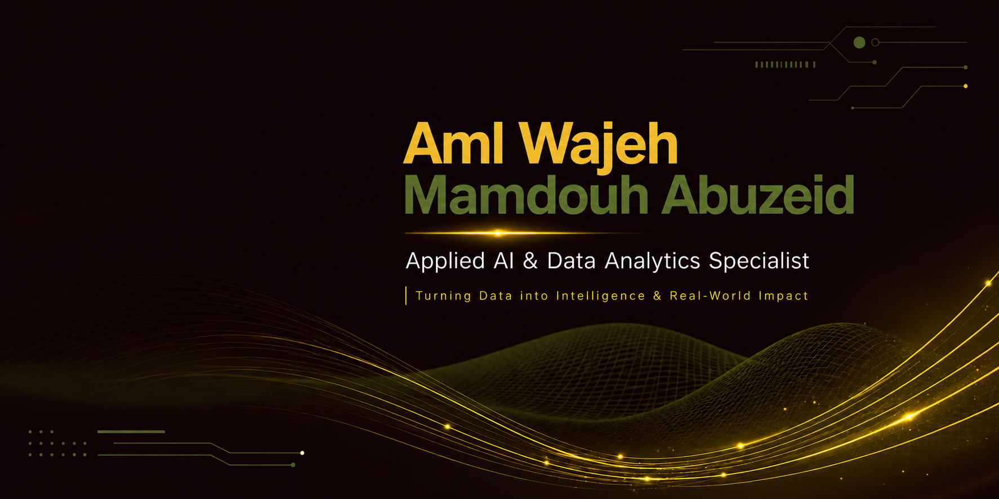

  

<!--
  Hi there! Thanks for visiting my profile.
  Last updated: May 2026
-->

# **Aml Wajeh Abuzeid**

### **Applied AI & Data Analytics Specialist | Business Intelligence Expert**

---

---

## 🎯 **Professional Identity**

> **Transforming complex data into strategic business outcomes** — I bridge the gap between raw complexity and strategic clarity, helping organizations unlock the value buried in their data. With **5+ years of professional experience** spanning business leadership and advanced AI/analytics, I deliver **precision-driven insights** that move the needle.

**📊 15% Employee Retention Improvement** · **⚡ 20% Reporting Time Reduction** · **📈 35% Faster Data Reporting** · **🎓 360+ Hours Elite Training**

---

## 👤 **About Me**

I'm a **Business Intelligence & Applied AI Specialist** with a unique dual expertise: deep technical mastery in AI/ML and data analytics, combined with strong business acumen from 5+ years of operational leadership. My background in business administration, coupled with intensive training in **Applied AI, Machine Learning, and Big Data Analytics**, positions me to solve complex business challenges through data-driven strategies.

Currently advancing my technical excellence in the **Digital Pioneers Initiative (Digilians)** — an elite program at the **Ministry of Communications and Information Technology (MCIT)** — where I engineer scalable Big Data analytics pipelines processing **1M+ daily data points** with military-grade precision and 100% adherence to operational timelines.

**What sets me apart:**
- ✅ **Business-First Approach**: Every analysis starts with the question "What business problem are we solving?"
- ✅ **Discipline**: 24/7 operational excellence and unwavering commitment to quality
- ✅ **End-to-End Ownership**: From raw data ingestion to executive dashboards and strategic recommendations
- ✅ **Quantifiable Impact**: Proven track record of delivering measurable business outcomes
- ✅ **Bilingual Communication**: Fluent in both technical and business languages

---

## 💼 **Core Expertise**

| **Applied AI & Machine Learning** | **Data Analytics & Engineering** | **Business Intelligence** |
|:---:|:---:|:---:|
| Predictive Modeling | ETL Processes | Executive Dashboards |
| Deep Learning (CNN, RNN, GAN) | Data Warehousing | KPI Development |
| Neural Networks | Big Data Analytics | Data Storytelling |
| Computer Vision | Data Governance | Strategic Reporting |
| NLP & Text Analytics | Statistical Analysis | Business Strategy |

---

## 🛠️ **Technical Arsenal**

### **Programming & Databases**

### **Machine Learning & AI**

### **Business Intelligence & Visualization**

### **Cloud & DevOps**

### **Analytics & Collaboration Tools**

---

## 🚀 **Featured Projects**

### **Portfolio Highlights**

---

### **1. End-to-End Transportation & Logistics Tracking Intelligence System**

**Business Challenge:** Supply chain inefficiencies causing delayed deliveries and increased operational costs across logistics operations.

**Solution Architecture:**
- Engineered predictive models using Python and SQL for deep data mining to identify bottlenecks
- Built real-time tracking intelligence system with automated alert mechanisms
- Developed route optimization algorithms to streamline logistics pipelines

**Business Impact:**
- ✅ **Significant reduction in delivery delays** through optimized routing
- ✅ **Improved operational efficiency** via predictive bottleneck identification
- ✅ **Enhanced visibility** across the entire supply chain pipeline

**Technical Highlights:**
- Predictive modeling for delivery time estimation
- SQL-based data warehousing for historical trend analysis
- Real-time dashboard for logistics KPI monitoring

📂 **[View Project]([https://github.com/aml-wajeh](https://github.com/aml-wajeh/End-to-End-Logistics-Intelligence-System))** · 

---

### **2. Body Performance Analytics & Intelligent Classification System**

**Business Challenge:** Need for comprehensive analysis of body performance metrics to identify key health indicators and optimize fitness outcomes.

**Solution Architecture:**
- Developed advanced data models in Python for body performance analysis
- Created interactive Tableau dashboards tracking core performance metrics over time
- Implemented intelligent classification system for fitness level categorization

**Business Impact:**
- ✅ **Actionable insights into fitness trend correlations** for training optimization
- ✅ **Data-driven recommendations** for performance improvement
- ✅ **Real-time visualization** of health indicators and progress tracking

**Technical Highlights:**
- Exploratory Data Analysis (EDA) on performance metrics
- Statistical modeling for trend identification
- Interactive visualization with drill-down capabilities

📂 **[View Project]([https://github.com/aml-wajeh](https://github.com/aml-wajeh/Body-Performance-Analytics-and-Intelligent-Classification-System))** · 

---

### **3. SmartMart Executive Sales Intelligence Dashboard**

**Business Challenge:** Transform 10,000+ rows of raw sales data into strategic intelligence within a strict 7-day deadline while maintaining 100% data integrity.

**Solution Architecture:**
- Engineered comprehensive end-to-end sales intelligence solution in Power BI
- Developed advanced DAX measures for MoM/YoY growth and Average Order Value (AOV)
- Automated reporting workflows with time-series analysis by hour and weekday

**Business Impact:**
- ✅ **~20% reduction in reporting time** through automation
- ✅ **Real-time revenue visibility** with advanced analytical metrics
- ✅ **3 strategic business insights** and **2 actionable recommendations** delivered
- ✅ **100% on-time delivery** within 7-day constraint

**Technical Highlights:**
- Advanced DAX calculations for growth metrics
- Power Query for ETL automation
- Time-series analysis for pattern identification
- Regional performance comparison dashboards

📂 **[View Project]([https://github.com/aml-wajeh](https://github.com/aml-wajeh/SmartMart_Executive_Sales))** · 

---

### **4. Adventure Works: End-to-End Business Intelligence & Predictive Analytics Suite**

**Business Challenge:** Comprehensive business intelligence solution needed for multi-dimensional sales, inventory, and customer analytics across global operations.

**Solution Architecture:**
- Designed enterprise-grade data warehouse using SQL Server
- Built predictive models for sales forecasting and inventory optimization
- Created executive dashboards with drill-through capabilities for regional analysis

**Business Impact:**
- ✅ **Enhanced decision-making** through real-time KPI visibility
- ✅ **Improved forecasting accuracy** for inventory management
- ✅ **Identified revenue optimization opportunities** across product categories

**Technical Highlights:**
- Database modeling and ERD design
- ETL processes for data integration
- Advanced analytics with Python and R
- Multi-layered Power BI dashboards

📂 **[View Project]([https://github.com/aml-wajeh](https://github.com/aml-wajeh/Adventure-Works-End-to-End-Business-Intelligence-Predictive-Analytics-Suite.git))** · 

---

### **5. HR Analytics: Employee Retention & Performance Intelligence**

**Business Challenge:** High employee attrition with no structured system to identify key drivers of turnover across a 500+ employee workforce.

**Solution Architecture:**
- Built end-to-end analytics pipeline using SQL for data extraction
- Performed comprehensive EDA in Python to surface attrition hotspots
- Developed interactive Power BI dashboards for performance patterns and department-level KPIs

**Business Impact:**
- ✅ **15% improvement in employee retention** through data-driven HR decisions
- ✅ **40% reduction in HR reporting time** via automated dashboards
- ✅ **Real-time performance monitoring system** for proactive intervention
- ✅ **Predictive attrition model** for early warning detection

**Technical Highlights:**
- Predictive attrition modeling
- Employee satisfaction tracking metrics
- Cross-functional collaboration dashboards
- Senior management executive reports

📂 **[View Project]([https://github.com/aml-wajeh](https://github.com/aml-wajeh/HR-Analysis))** · 

---

## 🎯 **AI & Data Specialization**

| **Applied AI** | **Predictive Analytics** | **Business Intelligence** |
|:---|:---|:---|
| Machine Learning pipelines | Forecasting models | Executive dashboards |
| Deep Learning architectures | Trend analysis | KPI tracking systems |
| Computer Vision applications | Risk modeling | Performance scorecards |
| NLP & text analytics | Customer segmentation | Strategic reporting |
| Neural Networks (CNN, RNN, GAN) | Demand forecasting | Data storytelling |

---

## 💡 **Business Impact & Value Creation**

### **Transforming Data into Strategic Decisions**

✔ **Predictive Insights**: Building ML models that forecast trends and enable proactive decision-making  
✔ **Intelligent Automation**: Reducing manual reporting time by 20-40% through automated pipelines  
✔ **Operational Optimization**: Identifying efficiency gains and cost reduction opportunities  
✔ **Executive Reporting**: Creating C-suite ready dashboards that drive strategic initiatives  
✔ **KPI Tracking**: Real-time monitoring systems for performance management  
✔ **Business Growth Enablement**: Data-driven recommendations that increase revenue and retention  
✔ **Data Governance**: Ensuring 100% data integrity across all analytics solutions  

---

## 💼 **Professional Experience Snapshot**

| **Role** | **Organization** | **Duration** | **Key Achievement** |
|:---|:---|:---|:---|
| **Applied AI & Data Analytics Trainee** | Digilians MCIT | Dec 2025 - Present | 1M+ daily data points processed |
| **Freelance Data Analyst** | Global Platforms | Oct 2024 - Dec 2025 | 5+ international clients served |
| **Business Intelligence Analyst** | National Telecommunication Institute | Nov 2024 - Feb 2025 | 35% faster reporting achieved |
| **Data Analyst Specialist** | Digital Egypt Pioneers Initiative | Apr 2024 - Oct 2024 | 3+ ETL processes orchestrated |
| **Company Director** | Moltaqa Al-Alam Tour Company | Jan 2017 - Aug 2023 | 6+ years operational leadership |

---

## 📜 **Certifications & Credentials**

### **2026**
- **Google Data Analytics Professional Certificate** — Google (Coursera) | *Issued Apr 2026*

### **2025**
- **IBM SkillsBuild Certified Data Analytics** — Education for Employment (EFE-Global) | *Issued May 2025*
- **Data Analytics and Visualization** — Sprints & National Council for Women | *Issued Jun 2025*
- **Data Analyst Freelancer** — Information Technology Industry Development Agency (ITIDA) | *Issued Apr 2025*
- **AI & Machine Learning Specialist** — Ministry of Youth & Sports (Shabab Mubtakir) & Huawei | *Issued Feb 2025*

### **2024**
- **Data Analytics Bootcamp (3-Month Intensive Program)** — Alexander Freberg (Alex The Analyst) | *Issued Mar 2024*

---

## 📊 **GitHub Analytics**

---

## 🎯 **Currently Working On**

| **Focus Area** | **Description** |
|:---|:---|
| 🔬 **Applied AI Research** | Advanced Deep Learning architectures (CNNs, RNNs, GANs) for real-world business applications |
| 📊 **Big Data Analytics** | Scalable analytics pipelines processing 1M+ daily data points at Digilians |
| 🤖 **Machine Learning Engineering** | Production-ready ML models with MLOps best practices |
| 📈 **Predictive Intelligence** | Building forecasting systems for strategic decision support |
| 🎓 **Technical Excellence** | Mastering precision in AI/ML delivery (24/7 operational discipline) |

---

## 🔮 **Learning & Research Interests**

- **Advanced Deep Learning**: Generative AI, Transformers, and Large Language Models
- **Computer Vision**: Object detection, image segmentation, and visual analytics
- **MLOps & AI Engineering**: Model deployment, monitoring, and lifecycle management
- **Big Data Technologies**: Distributed computing and real-time stream processing
- **AI Ethics & Responsible AI**: Bias detection, fairness, and explainable AI
- **Cloud-Native AI**: Azure ML, cloud architecture, and scalable AI solutions
- **Business Intelligence Strategy**: Data governance, analytics maturity, and BI transformation

---

## 🤝 **Open To Opportunities**

### **Let's Build Something Impactful Together**

I'm actively seeking **senior-level opportunities** where I can leverage my unique combination of **business leadership experience** and **advanced AI/analytics expertise** to drive measurable impact.

**🎯 Target Roles:**
- Applied AI Specialist
- AI Engineer / Machine Learning Engineer
- Senior Data Scientist / Data Analyst
- Business Intelligence Analyst / Consultant
- Analytics Engineer
- Data Strategy Consultant

**💡 What I Bring:**
- ✅ **5+ years** of professional experience with proven business impact
- ✅ **360+ hours** of elite technical training (DEPI, NTI, Digilians)
- ✅ **Bilingual expertise**: Business strategy + Technical execution
- ✅ **Quantifiable results**: 15% retention improvement, 20% time savings, 35% faster reporting

**🌍 Availability:**
- ✅ **Open to relocation** for the right opportunity
- ✅ **Remote-friendly** with flexible collaboration
- ✅ **Immediate availability** for full-time roles
- ✅ **Open to consulting projects** and strategic collaborations

---

## 📬 **Let's Connect**

### **Ready to transform your data into strategic advantage?**

---

### **📍 Based in Cairo, Egypt | 🌍 Available for Global Opportunities**

**📧 aml.wajeh24@gmail.com** · **📱 (+20) 1115087087**

---

**Built with precision, discipline, and a commitment to excellence** ⚡

*Thank you for visiting my profile. Let's create data-driven impact together.*

<!--
  Profile Color Theme: Non-Binary Pride Inspired
  Colors: #F4E842 (Yellow), #9CAF3E (Olive), #4A5F2F (Dark Olive), #1A1A1A (Dark)
  
  Last Updated: May 2026
  Maintained with ❤️ 
-->
